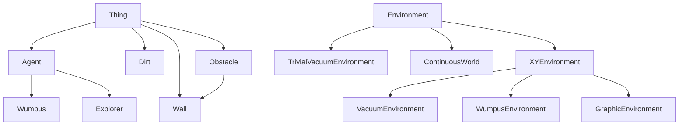

# Explanation of agents.py

The `agents.py` file implements the agent-environment framework from Chapters 1-2 of the "Artificial Intelligence: A Modern Approach" (AIMA) textbook. This file provides a foundation for creating intelligent agents that interact with various environments.

## Core Class Hierarchy

### Key Classes

1. **Thing** (lines 47-66)
   - Base class for all physical objects in environments
   - Has methods like `is_alive()`, `show_state()`, and `display()`

2. **Agent** (lines 69-98)
   - Subclass of Thing that can perceive and act in an environment
   - Has a `program` attribute that maps percepts to actions
   - Tracks performance, alive status, and items being held

3. **Environment** (lines 285-384)
   - Abstract class representing the world where agents operate
   - Manages things and agents within the environment
   - Provides methods for adding/removing things and running simulations
   - Key methods include `percept()`, `execute_action()`, `step()`, and `run()`

4. **XYEnvironment** (lines 466-600)
   - Environment with a 2D grid representation
   - Handles agent movement, obstacle detection, and wall creation
   - Provides methods for finding things at specific locations

## Agent Programs

The file implements several types of agent programs:

1. **TableDrivenAgentProgram** (lines 118-133)
   - Uses a lookup table to map percept sequences to actions
   - Practical only for tiny domains due to memory requirements

2. **RandomAgentProgram** (lines 136-147)
   - Chooses actions randomly, ignoring percepts

3. **SimpleReflexAgentProgram** (lines 153-165)
   - Takes action based solely on current percept
   - Uses rules to match state to actions

4. **ModelBasedReflexAgentProgram** (lines 168-181)
   - Takes action based on percept and internal state
   - Maintains a model of the world

## Specific Environments

### Vacuum World

1. **VacuumEnvironment** (lines 730-764)
   - 2D grid where agents clean dirt
   - Performance: +100 for each dirt cleaned, -1 for each action

2. **TrivialVacuumEnvironment** (lines 767-801)
   - Simplified environment with only two locations (A and B)
   - Performance: +10 for each dirt cleaned, -1 for each move

### Wumpus World

1. **WumpusEnvironment** (lines 861-1008)
   - Implementation of the classic Wumpus World problem
   - Contains pits, a wumpus monster, and gold
   - Agent must navigate dangers to find gold and return to start

## Utility Functions

1. **TraceAgent** (lines 101-112)
   - Wraps an agent's program to print inputs and outputs for debugging

2. **compare_agents** (lines 1014-1029)
   - Evaluates multiple agent types in the same environment type
   - Returns performance statistics

3. **test_agent** (lines 1032-1049)
   - Tests a single agent type across multiple environment instances

## Key Concepts Demonstrated

1. **Agent-Environment Interaction**:
   - Agents perceive through `percept()` method
   - Agents act through `execute_action()` method
   - Environment simulates through `step()` and `run()` methods

2. **Agent Types**:
   - Simple reflex agents (act based on current percept)
   - Model-based reflex agents (maintain internal state)
   - Table-driven agents (use lookup tables)
   - Random agents (choose actions randomly)

3. **Performance Measurement**:
   - Each agent has a performance score
   - Different environments define different scoring systems